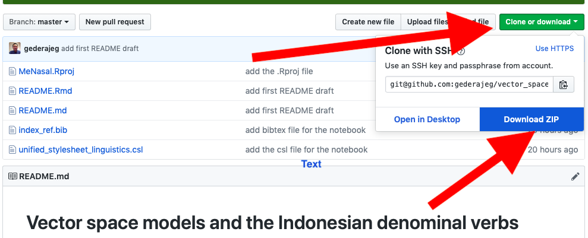
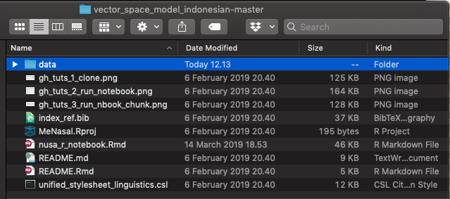
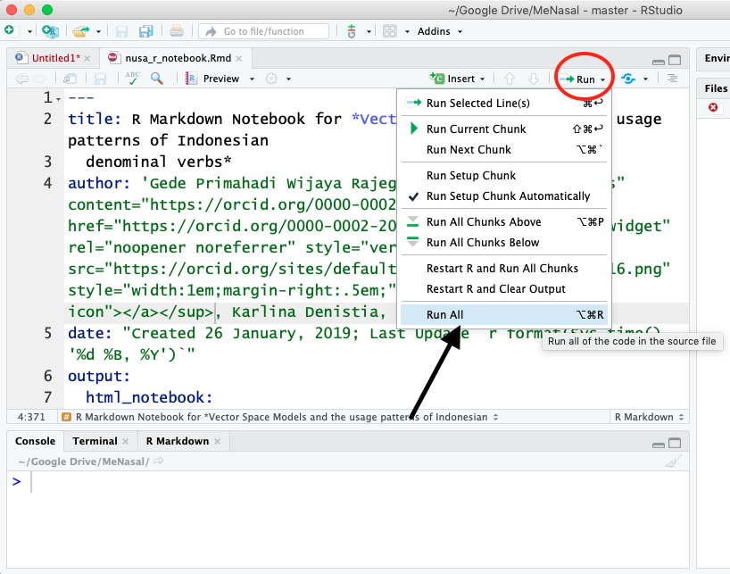
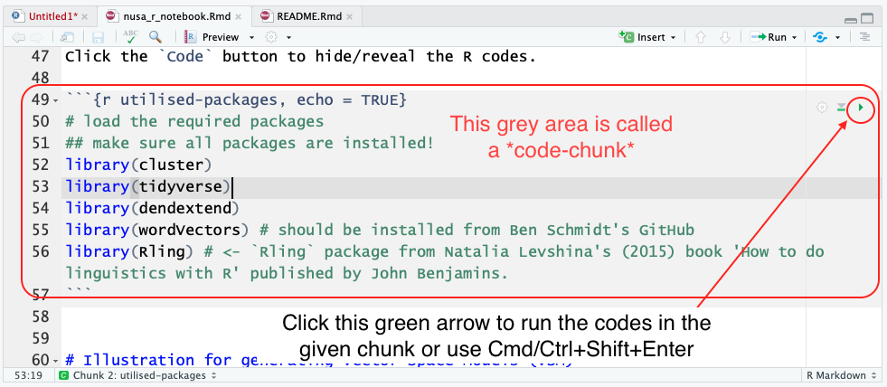

Vector space models and the usage patterns of Indonesian denominal verbs
================
[Gede Primahadi Wijaya
Rajeg](https://figshare.com/authors/Gede_Primahadi_Wijaya_Rajeg/1234749)
<a itemprop="sameAs" content="https://orcid.org/0000-0002-2047-8621" href="https://orcid.org/0000-0002-2047-8621" target="orcid.widget" rel="noopener noreferrer" style="vertical-align:top;"></a>,
[Karlina Denistia](http://uni-tuebingen.academia.edu/karlinadenistia)
<a itemprop="sameAs" content="http://orcid.org/0000-0002-1060-3548" href="http://orcid.org/0000-0002-1060-3548" target="orcid.widget" rel="noopener noreferrer" style="vertical-align:top;"></a>,
[Simon Musgrave](http://profiles.arts.monash.edu.au/simon-musgrave/)
<a itemprop="sameAs" content="https://orcid.org/0000-0003-3237-9943" href="https://orcid.org/0000-0003-3237-9943" target="orcid.widget" rel="noopener noreferrer" style="vertical-align:top;"></a>

<!-- README.md is generated from README.Rmd. Please edit that file -->

<a rel="license" href="http://creativecommons.org/licenses/by-nc-sa/4.0/"></a><br />This
work is licensed under a
<a rel="license" href="http://creativecommons.org/licenses/by-nc-sa/4.0/">Creative
Commons Attribution-NonCommercial-ShareAlike 4.0 International
License</a>.

This is a repository containing the source [R
Markdown](http://rmarkdown.rstudio.com)
[Notebook](https://bookdown.org/yihui/rmarkdown/notebook.html) (i.e.
`nusa_r_notebook.Rmd`) for the quantitative analyses accompanying our
paper on vector space models and Indonesian denominal verbs (accepted
for publication in
[*NUSA*](http://www.aa.tufs.ac.jp/en/publications/nusa)’s special issue
titled [*Linguistic studies using large annotated
corpora*](https://malindo.aa-ken.jp/call67.html), edited by [Hiroki
Nomoto](http://www.tufs.ac.jp/ts/personal/nomoto/) and [David
Moeljadi](http://compling.hss.ntu.edu.sg/who/david/)). The Notebook,
however, does not provide detailed exposition and discussion for each
points. Also, there can be differences in some of the text-narratives in
the Notebook compared to the published manuscript after revision.
Readers are referred to our published paper for details. Our
computational analyses in the R Notebook used the following
[R](https://www.r-project.org) packages, which have to be installed in R
to run all codes in the
    Notebook:

  - [cluster](https://cran.r-project.org/web/packages/cluster/index.html)
    (version 2.0.7-1) (Maechler et al.
    [2018](#ref-maechler_cluster_2018))
  - [tidyverse](https://www.tidyverse.org) (version 1.2.1) (Wickham &
    Grolemund [2017](#ref-wickham_r_2017)), the core of which includes:
      - [dplyr](https://dplyr.tidyverse.org) (version 0.7.8) (Wickham et
        al. [2018](#ref-wickham_dplyr_2018))
      - [ggplot2](https://ggplot2.tidyverse.org) (version 3.1.0)
        (Wickham [2016](#ref-wickham_ggplot2_2016))
      - [purrr](https://purrr.tidyverse.org) (version 0.3.0) (Henry &
        Wickham [2019](#ref-henry_purrr_2019))
      - [readr](https://readr.tidyverse.org) (version 1.3.1) (Wickham,
        Hester & Francois [2018](#ref-wickham_readr_2018))
      - [stringr](https://stringr.tidyverse.org) (version 1.3.1)
        (Wickham [2018](#ref-wickham_stringr_2018))
      - [tidyr](https://tidyr.tidyverse.org) (version 0.8.2) (Wickham &
        Henry [2018](#ref-wickham_tidyr_2018))
      - [tibble](https://tibble.tidyverse.org) (version 2.0.1) (Müller &
        Wickham
    [2019](#ref-muller_tibble_2019))
  - [dendextend](https://cran.r-project.org/web/packages/dendextend/index.html)
    (version 1.8.0) (Galili [2015](#ref-galili_dendextend_2015))
  - [wordVectors](https://github.com/bmschmidt/wordVectors) (version
    2.0) (Schmidt & Li [2017](#ref-schmidt_wordvectors_2017))
  - [Rling](https://benjamins.com/sites/z.195/content/package.html)
    (version 1.0) (Levshina [2015](#ref-levshina_how_2015))

The analyses in the paper were conducted using R version 3.6.0
(2019-04-26) and [RStudio](https://www.rstudio.com) version 1.2.1335 for
macOS.

# How to download/clone the repository and the data

1.  Go to the GitHub repo(sitory):
    <https://github.com/gederajeg/vector_space_model_indonesian>.

2.  Then, find and click the green button saying `"Clone or download"`
    and then the `"Download ZIP"` option (see the picture below).
    
    

3.  The second step above will download the repo as a folder, by default
    called `vector_space_model_indonesian-master`. We suggest keep this
    folder’s name. The folder consists of, among others, README files,
    .bib file, and the R Notebook containing the R codes for producing
    the analyses in the paper (incl. figures and tables).

4.  Download the dataset from figshare (**ADD FIGSHARE DOI**) (we store
    them on figshare due to their large size for version control,
    especially for the vector space model). Please read the information
    page before clicking the white button saying `"Download all"` (next
    to the dark pink `"Cite"` button) to download all the data.

5.  Please rename the downloaded data folder into `data` and move this
    `data` folder inside the `vector_space_model_indonesian-master`
    folder so that the structure of the directory has to look like
    below:
    
    

# How to run the codes in the R Notebook

1.  Make sure all the required R packages mentioned above are installed
    in R and you have the latest version of
    [RStudio](https://www.rstudio.com) (download from
    [here](https://www.rstudio.com/products/rstudio/download/)).

2.  Next, go to the `vector_space_model_indonesian-master` folder and
    double-click the `MeNasal.Rproj` file. It will open up an RStudio
    session associated with data and codes in this project.

3.  Then, open the R Notebook file called `nusa_r_notebook.Rmd` by going
    to `File` \> `Open File ...` (or use <kbd>⌘</kbd>+<kbd>O</kbd> on
    macOS or <kbd>Ctrl</kbd>+<kbd>O</kbd> on Windows), then select the
    given `.Rmd` file.

4.  The codes can be run/executed all at once (i) using keyboard
    shortcut <kbd>⌥</kbd>+<kbd>⌘</kbd>+<kbd>R</kbd> on macOS (i.e.,
    <kbd>Option</kbd>+<kbd>Cmd</kbd>+<kbd>R</kbd>) or
    <kbd>Alt</kbd>+<kbd>Ctrl</kbd>+<kbd>R</kbd> on Windows, (ii) or by
    navigating to the drop-down `Run` button and select `Run All` as
    shown below.
    
    
    
    After running all the codes, reader may preview the notebook in HTML
    format by clicking on the `Preview` button or by using keyboard
    shortcut <kbd>⌘</kbd>+<kbd>⇧</kbd>+<kbd>K</kbd> (i.e.,
    <kbd>Cmd/Ctrl</kbd>+<kbd>Shift</kbd>+<kbd>K</kbd>).

5.  Alternative to the run-all option in (4) above, reader may wish to
    run the code chunk-by-chunk. The code-chunk is indicated by
    grey-shaded area in the Notebook (see the picture below).
    
    
    
    Place the cursor in each chunk and then use keyboard shortcut
    <kbd>⌘</kbd>+<kbd>⇧</kbd>+<kbd>Enter</kbd> (i.e.,
    <kbd>Cmd/Ctrl</kbd>+<kbd>Shift</kbd>+<kbd>Enter</kbd>) to run the
    codes in the given chunk. Another way is to click the green arrow
    button (see the picture above).

<!-- end list -->

``` r
devtools::session_info()
#> ─ Session info ──────────────────────────────────────────────────────────
#>  setting  value                       
#>  version  R version 3.6.0 (2019-04-26)
#>  os       macOS Mojave 10.14.6        
#>  system   x86_64, darwin15.6.0        
#>  ui       X11                         
#>  language (EN)                        
#>  collate  en_US.UTF-8                 
#>  ctype    en_US.UTF-8                 
#>  tz       Asia/Makassar               
#>  date     2019-10-11                  
#> 
#> ─ Packages ──────────────────────────────────────────────────────────────
#>  package     * version date       lib source        
#>  assertthat    0.2.1   2019-03-21 [1] CRAN (R 3.6.0)
#>  backports     1.1.4   2019-04-10 [1] CRAN (R 3.6.0)
#>  callr         3.2.0   2019-03-15 [1] CRAN (R 3.6.0)
#>  cli           1.1.0   2019-03-19 [1] CRAN (R 3.6.0)
#>  crayon        1.3.4   2017-09-16 [1] CRAN (R 3.6.0)
#>  desc          1.2.0   2018-05-01 [1] CRAN (R 3.6.0)
#>  devtools      2.0.2   2019-04-08 [1] CRAN (R 3.6.0)
#>  digest        0.6.19  2019-05-20 [1] CRAN (R 3.6.0)
#>  evaluate      0.14    2019-05-28 [1] CRAN (R 3.6.0)
#>  fs            1.3.1   2019-05-06 [1] CRAN (R 3.6.0)
#>  glue          1.3.1   2019-03-12 [1] CRAN (R 3.6.0)
#>  htmltools     0.3.6   2017-04-28 [1] CRAN (R 3.6.0)
#>  knitr         1.23    2019-05-18 [1] CRAN (R 3.6.0)
#>  magrittr      1.5     2014-11-22 [1] CRAN (R 3.6.0)
#>  memoise       1.1.0   2017-04-21 [1] CRAN (R 3.6.0)
#>  pkgbuild      1.0.3   2019-03-20 [1] CRAN (R 3.6.0)
#>  pkgload       1.0.2   2018-10-29 [1] CRAN (R 3.6.0)
#>  prettyunits   1.0.2   2015-07-13 [1] CRAN (R 3.6.0)
#>  processx      3.3.1   2019-05-08 [1] CRAN (R 3.6.0)
#>  ps            1.3.0   2018-12-21 [1] CRAN (R 3.6.0)
#>  R6            2.4.0   2019-02-14 [1] CRAN (R 3.6.0)
#>  Rcpp          1.0.1   2019-03-17 [1] CRAN (R 3.6.0)
#>  remotes       2.0.4   2019-04-10 [1] CRAN (R 3.6.0)
#>  rlang         0.4.0   2019-06-25 [1] CRAN (R 3.6.0)
#>  rmarkdown     1.13    2019-05-22 [1] CRAN (R 3.6.0)
#>  rprojroot     1.3-2   2018-01-03 [1] CRAN (R 3.6.0)
#>  sessioninfo   1.1.1   2018-11-05 [1] CRAN (R 3.6.0)
#>  stringi       1.4.3   2019-03-12 [1] CRAN (R 3.6.0)
#>  stringr       1.4.0   2019-02-10 [1] CRAN (R 3.6.0)
#>  testthat      2.1.1   2019-04-23 [1] CRAN (R 3.6.0)
#>  usethis       1.5.0   2019-04-07 [1] CRAN (R 3.6.0)
#>  withr         2.1.2   2018-03-15 [1] CRAN (R 3.6.0)
#>  xfun          0.8     2019-06-25 [1] CRAN (R 3.6.0)
#>  yaml          2.2.0   2018-07-25 [1] CRAN (R 3.6.0)
#> 
#> [1] /Users/Primahadi/Rlibs
#> [2] /Library/Frameworks/R.framework/Versions/3.6/Resources/library
```

# References

<div id="refs" class="references">

<div id="ref-galili_dendextend_2015">

Galili, Tal. 2015. Dendextend: An R package for visualizing, adjusting,
and comparing trees of hierarchical clustering. *Bioinformatics*.
doi:[10.1093/bioinformatics/btv428](https://doi.org/10.1093/bioinformatics/btv428).

</div>

<div id="ref-henry_purrr_2019">

Henry, Lionel & Hadley Wickham. 2019. *Purrr: Functional programming
tools*. <https://CRAN.R-project.org/package=purrr>.

</div>

<div id="ref-levshina_how_2015">

Levshina, Natalia. 2015. *How to do Linguistics with R: Data exploration
and statistical analysis*. John Benjamins Publishing Company.

</div>

<div id="ref-maechler_cluster_2018">

Maechler, Martin, Peter Rousseeuw, Anja Struyf, Mia Hubert & Kurt
Hornik. 2018. *Cluster: Cluster Analysis Basics and Extensions*.

</div>

<div id="ref-muller_tibble_2019">

Müller, Kirill & Hadley Wickham. 2019. *Tibble: Simple data frames*.
<https://CRAN.R-project.org/package=tibble>.

</div>

<div id="ref-schmidt_wordvectors_2017">

Schmidt, Ben & Jian Li. 2017. *wordVectors: Tools for creating and
analyzing vector-space models of texts*.
<http://github.com/bmschmidt/wordVectors>.

</div>

<div id="ref-wickham_ggplot2_2016">

Wickham, Hadley. 2016. *Ggplot2: Elegant graphics for data analysis*.
Springer-Verlag New York. <http://ggplot2.org>.

</div>

<div id="ref-wickham_stringr_2018">

Wickham, Hadley. 2018. *Stringr: Simple, consistent wrappers for common
string operations*. <https://CRAN.R-project.org/package=stringr>.

</div>

<div id="ref-wickham_dplyr_2018">

Wickham, Hadley, Romain François, Lionel Henry & Kirill Müller. 2018.
*Dplyr: A grammar of data manipulation*.
<https://CRAN.R-project.org/package=dplyr>.

</div>

<div id="ref-wickham_r_2017">

Wickham, Hadley & Garrett Grolemund. 2017. *R for Data Science*. Canada:
O’Reilly. <http://r4ds.had.co.nz/> (7 March, 2017).

</div>

<div id="ref-wickham_tidyr_2018">

Wickham, Hadley & Lionel Henry. 2018. *Tidyr: Easily tidy data with
’spread()’ and ’gather()’ functions*.
<https://CRAN.R-project.org/package=tidyr>.

</div>

<div id="ref-wickham_readr_2018">

Wickham, Hadley, Jim Hester & Romain Francois. 2018. *Readr: Read
rectangular text data*. <https://CRAN.R-project.org/package=readr>.

</div>

</div>
